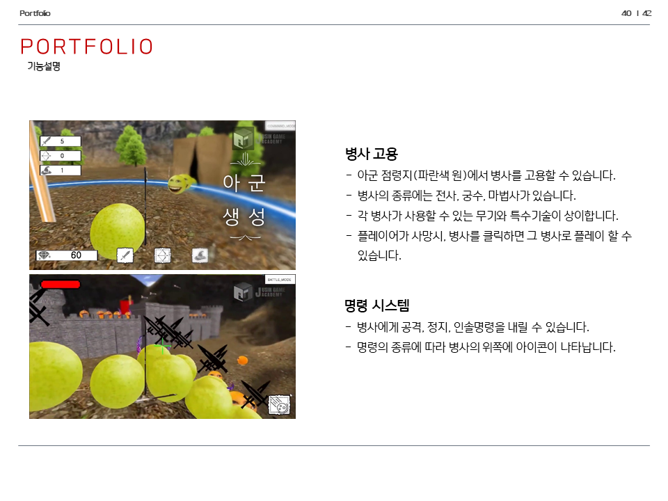
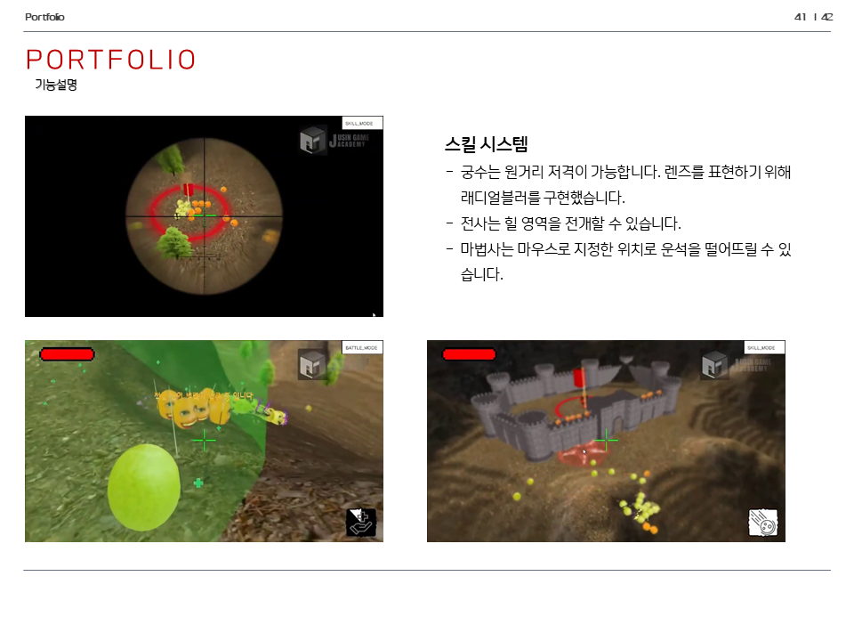
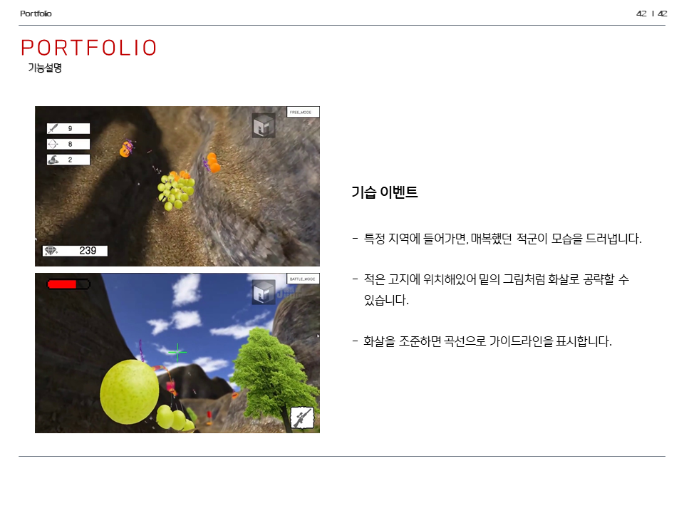
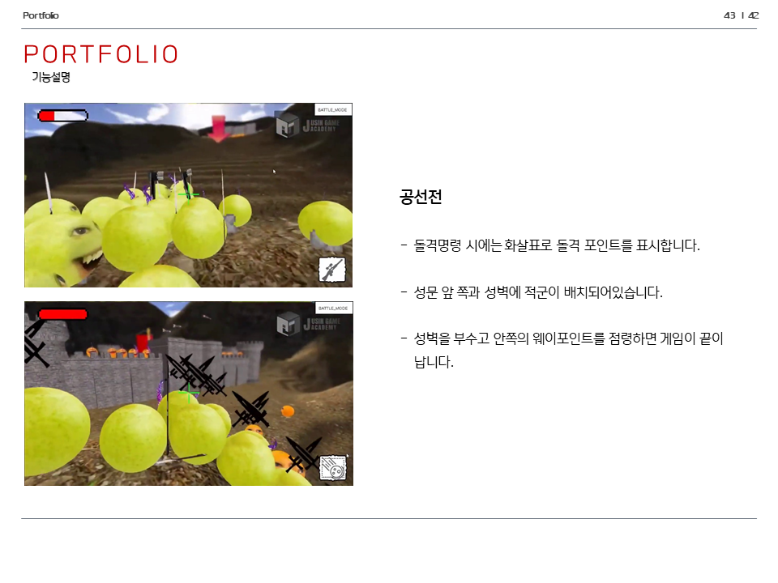
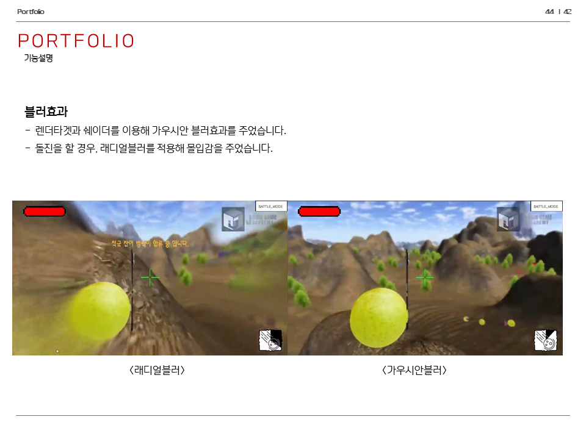

# war-game-3D
DirectX9, Win32API 로 만든 창작 전쟁게임입니다.


## 사용기술
C++, DirectX9, MFC, WIN32API


## 실행법
```
# 깃 허브에서 소스코드를 다운로드 받습니다.
git clone https://github.com/bsw112/anime_worldcup.git

# DirectX9을 설치합니다.

# 비주얼 스튜디오로 빌드합니다. 개발환경은 비주얼스튜디오 2016 버전입니다.

솔루션 탐색기 > client > 프로젝트 속성 > HLSL 컴파일러 > 셰이더형식을 효과(/fx) 로 맞춰줍니다.
솔루션 탐색기 > client > 프로젝트 속성 > HLSL 컴파일러 > 셰이더모델을 Shader Model2(/2.0) 으로 맞춰줍니다.
솔루션 탐색기 > client > 프로젝트 속성 > 링커 > 입력 > 추가 종속성에서 d3d9.lib, d3dx9.lib 를 추가해줍니다. 
솔루션 탐색기 > client > 빌드를 통해 빌드합니다.

```


## 주요기능
* 웨이포인트 점령
* 병사고용
* 각각의 병사는 고유한 무기와 스킬을 가지고 있음.
* 명령시스템 (공격, 정지, 인솔명령)
* 기습이벤트 구현
* 가우시안블러, 래디얼블러


## 실제화면






## 시연
](https://www.youtube.com/watch?v=-TCkKDWs3Jg)
